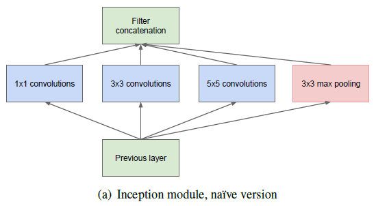
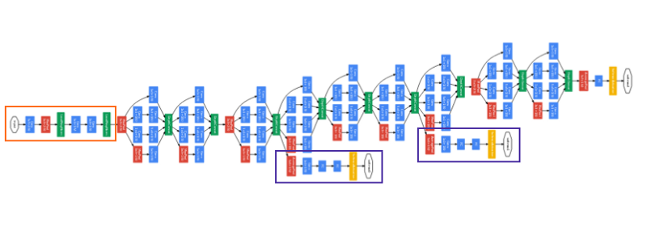

# AlexNet
AlexNet famously won the 2012 ImageNet LSVRC-2012 competition by a large margin (15.3% VS 26.2% (second place) error rates).

    
    

### The highlights of the paper
- Use Relu instead of Tanh to add non-linearity. It accelerates the speed by 6 times at the same accuracy.
- Use dropout instead of regularisation to deal with overfitting. However the training time is doubled with the dropout rate of 0.5.
- Overlap pooling to reduce the size of network. It reduces the top-1 and top-5 error rates by 0.4% and 0.3%, repectively.

### The architecture
It contains 5 convolutional layers and 3 fully connected layers. Relu is applied after very convolutional and fully connected layer. Dropout is applied before the first and the second fully connected year. The image size in the following architecutre chart should be 227 * 227 instead of 224 * 224, as it is pointed out by Andrei Karpathy in his famous CS231n Course.

# AlexNet implementation on Cifar 10

## Data Loading and Preprocessing

### CIFAR10 small image classification
Dataset of 50,000 32x32 color training images, labeled over 10 categories, and 10,000 test images.

#### Returns 2 tuples:
- **x_train, x_test**: uint8 array of RGB image data with shape (num_samples, 32, 32, 3).
- **y_train, y_test**: uint8 array of category labels (integers in range 0-9) with shape (num_samples,).

#### Traning & Testing sets

    Number of training examples = 50000
    Number of testing examples = 10000
    Image data shape = (32, 32, 3)
    Number of classes = 10

## Model Implementation

### Model Architecture

The entire model consists of 14 layers in total. In addition to layers below lists what techniques are applied to build the model.
- **Convolution with 64 different filters in size of (3x3)**
    - ReLU activation function
- **Max Pooling by 2**
    - Batch Normalization
- **Convolution with 128 different filters in size of (3x3)**
    - ReLU activation function
- **Max Pooling by 2**
    - Batch Normalization
- **Convolution with 256 different filters in size of (3x3)**
    - ReLU activation function
- **Max Pooling by 2**
    - Batch Normalization
- **Convolution with 512 different filters in size of (3x3)**
    - ReLU activation function
- **Max Pooling by 2**
    - Batch Normalization
- **Flattening the 3-D output of the last convolving operations.**
- **Fully Connected Layer with 128 units**
    - ReLU activation function
    - Dropout
    - Batch Normalization
- **Fully Connected Layer with 256 units**
    - ReLU activation function
    - Dropout
    - Batch Normalization
- **Fully Connected Layer with 512 units**
    - ReLU activation function
    - Dropout
    - Batch Normalization
- **Fully Connected Layer with 1024 units**
    - ReLU activation function
    - Dropout
    - Batch Normalization
- **Fully Connected Layer with 10 units (number of image classes)**
    - Softmax activation function

    
    

## Training
    Train on 40000 samples, validate on 10000 samples
    Epoch 1/50
    40000/40000 [==============================] - 65s 2ms/step - loss: 1.9404 - acc: 0.3389 - val_loss: 1.8773 - val_acc: 0.3188
    Epoch 2/50
    40000/40000 [==============================] - 58s 1ms/step - loss: 1.3196 - acc: 0.5319 - val_loss: 1.3234 - val_acc: 0.5172
    Epoch 3/50
    40000/40000 [==============================] - 58s 1ms/step - loss: 1.0390 - acc: 0.6328 - val_loss: 1.0560 - val_acc: 0.6246
    Epoch 4/50
    40000/40000 [==============================] - 65s 2ms/step - loss: 0.8421 - acc: 0.7060 - val_loss: 1.1719 - val_acc: 0.6147
    Epoch 5/50
    40000/40000 [==============================] - 58s 1ms/step - loss: 0.7104 - acc: 0.7552 - val_loss: 0.9906 - val_acc: 0.6848
    Epoch 6/50
    40000/40000 [==============================] - 57s 1ms/step - loss: 0.6054 - acc: 0.7914 - val_loss: 1.0933 - val_acc: 0.6836
    Epoch 7/50
    40000/40000 [==============================] - 59s 1ms/step - loss: 0.5124 - acc: 0.8251 - val_loss: 0.8151 - val_acc: 0.7463
    Epoch 8/50
    40000/40000 [==============================] - 60s 1ms/step - loss: 0.3959 - acc: 0.8666 - val_loss: 0.8795 - val_acc: 0.7407
    Epoch 9/50
    40000/40000 [==============================] - 58s 1ms/step - loss: 0.3343 - acc: 0.8863 - val_loss: 0.9451 - val_acc: 0.7437
    Epoch 10/50
    40000/40000 [==============================] - 61s 2ms/step - loss: 0.2689 - acc: 0.9107 - val_loss: 0.8430 - val_acc: 0.7707
    Epoch 11/50
    40000/40000 [==============================] - 61s 2ms/step - loss: 0.1995 - acc: 0.9343 - val_loss: 1.1232 - val_acc: 0.7356
    Epoch 12/50
    40000/40000 [==============================] - 58s 1ms/step - loss: 0.2044 - acc: 0.9333 - val_loss: 0.8803 - val_acc: 0.7794
    Epoch 13/50
    40000/40000 [==============================] - 62s 2ms/step - loss: 0.1449 - acc: 0.9525 - val_loss: 1.1271 - val_acc: 0.7458
    Epoch 14/50
    40000/40000 [==============================] - 67s 2ms/step - loss: 0.1305 - acc: 0.9574 - val_loss: 1.3599 - val_acc: 0.7299
    Epoch 15/50
    40000/40000 [==============================] - 61s 2ms/step - loss: 0.1207 - acc: 0.9603 - val_loss: 1.1263 - val_acc: 0.7558
    Epoch 16/50
    40000/40000 [==============================] - 69s 2ms/step - loss: 0.1240 - acc: 0.9591 - val_loss: 1.0941 - val_acc: 0.7639
    Epoch 17/50
    40000/40000 [==============================] - 57s 1ms/step - loss: 0.0861 - acc: 0.9718 - val_loss: 1.2752 - val_acc: 0.7409
    Epoch 18/50
    40000/40000 [==============================] - 62s 2ms/step - loss: 0.1089 - acc: 0.9640 - val_loss: 1.1237 - val_acc: 0.7696
    Epoch 19/50
    40000/40000 [==============================] - 64s 2ms/step - loss: 0.0852 - acc: 0.9722 - val_loss: 1.4846 - val_acc: 0.7283
    Epoch 20/50
    40000/40000 [==============================] - 64s 2ms/step - loss: 0.0623 - acc: 0.9795 - val_loss: 1.1319 - val_acc: 0.7802
    Epoch 21/50
    40000/40000 [==============================] - 60s 2ms/step - loss: 0.0608 - acc: 0.9799 - val_loss: 1.3421 - val_acc: 0.7398
    Epoch 22/50
    40000/40000 [==============================] - 59s 1ms/step - loss: 0.1377 - acc: 0.9557 - val_loss: 1.1217 - val_acc: 0.7656
    Epoch 23/50
    40000/40000 [==============================] - 57s 1ms/step - loss: 0.0858 - acc: 0.9710 - val_loss: 1.1516 - val_acc: 0.7691
    Epoch 24/50
    40000/40000 [==============================] - 58s 1ms/step - loss: 0.0392 - acc: 0.9873 - val_loss: 1.3493 - val_acc: 0.7585
    Epoch 25/50
    40000/40000 [==============================] - 60s 2ms/step - loss: 0.0547 - acc: 0.9825 - val_loss: 1.2142 - val_acc: 0.7795
    Epoch 26/50
    40000/40000 [==============================] - 57s 1ms/step - loss: 0.0527 - acc: 0.9832 - val_loss: 1.0990 - val_acc: 0.7857
    Epoch 27/50
    40000/40000 [==============================] - 59s 1ms/step - loss: 0.0412 - acc: 0.9873 - val_loss: 1.2918 - val_acc: 0.7622
    Epoch 28/50
    40000/40000 [==============================] - 59s 1ms/step - loss: 0.0352 - acc: 0.9889 - val_loss: 1.2856 - val_acc: 0.7718
    Epoch 29/50
    40000/40000 [==============================] - 58s 1ms/step - loss: 0.0564 - acc: 0.9827 - val_loss: 1.2348 - val_acc: 0.7612
    Epoch 30/50
    40000/40000 [==============================] - 62s 2ms/step - loss: 0.0614 - acc: 0.9802 - val_loss: 1.0940 - val_acc: 0.7808
    Epoch 31/50
    40000/40000 [==============================] - 63s 2ms/step - loss: 0.0482 - acc: 0.9843 - val_loss: 1.3662 - val_acc: 0.7522
    Epoch 32/50
    40000/40000 [==============================] - 59s 1ms/step - loss: 0.0342 - acc: 0.9895 - val_loss: 1.2255 - val_acc: 0.7772
    Epoch 33/50
    40000/40000 [==============================] - 57s 1ms/step - loss: 0.0409 - acc: 0.9869 - val_loss: 1.2192 - val_acc: 0.7753
    Epoch 34/50
    40000/40000 [==============================] - 61s 2ms/step - loss: 0.0436 - acc: 0.9862 - val_loss: 1.1923 - val_acc: 0.7738
    Epoch 35/50
    40000/40000 [==============================] - 55s 1ms/step - loss: 0.0281 - acc: 0.9905 - val_loss: 1.2928 - val_acc: 0.7728
    Epoch 36/50
    40000/40000 [==============================] - 57s 1ms/step - loss: 0.0273 - acc: 0.9912 - val_loss: 1.6074 - val_acc: 0.7258
    Epoch 37/50
    40000/40000 [==============================] - 55s 1ms/step - loss: 0.0672 - acc: 0.9780 - val_loss: 1.1773 - val_acc: 0.7752
    Epoch 38/50
    40000/40000 [==============================] - 55s 1ms/step - loss: 0.0252 - acc: 0.9917 - val_loss: 1.3223 - val_acc: 0.7787
    Epoch 39/50
    40000/40000 [==============================] - 55s 1ms/step - loss: 0.0326 - acc: 0.9894 - val_loss: 1.3738 - val_acc: 0.7677
    Epoch 40/50
    40000/40000 [==============================] - 55s 1ms/step - loss: 0.0271 - acc: 0.9912 - val_loss: 1.3072 - val_acc: 0.7748
    Epoch 41/50
    40000/40000 [==============================] - 55s 1ms/step - loss: 0.0204 - acc: 0.9938 - val_loss: 1.3077 - val_acc: 0.7766
    Epoch 42/50
    40000/40000 [==============================] - 55s 1ms/step - loss: 0.0193 - acc: 0.9936 - val_loss: 1.3706 - val_acc: 0.7736
    Epoch 43/50
    40000/40000 [==============================] - 64s 2ms/step - loss: 0.0207 - acc: 0.9936 - val_loss: 1.3584 - val_acc: 0.7727
    Epoch 44/50
    40000/40000 [==============================] - 63s 2ms/step - loss: 0.0323 - acc: 0.9900 - val_loss: 1.2489 - val_acc: 0.7813
    Epoch 45/50
    40000/40000 [==============================] - 57s 1ms/step - loss: 0.0718 - acc: 0.9785 - val_loss: 1.1412 - val_acc: 0.7821
    Epoch 46/50
    40000/40000 [==============================] - 57s 1ms/step - loss: 0.0327 - acc: 0.9894 - val_loss: 1.2652 - val_acc: 0.7837
    Epoch 47/50
    40000/40000 [==============================] - 59s 1ms/step - loss: 0.0163 - acc: 0.9947 - val_loss: 1.3472 - val_acc: 0.7792
    Epoch 48/50
    40000/40000 [==============================] - 59s 1ms/step - loss: 0.0214 - acc: 0.9936 - val_loss: 1.3024 - val_acc: 0.7786
    Epoch 49/50
    40000/40000 [==============================] - 60s 2ms/step - loss: 0.0365 - acc: 0.9885 - val_loss: 1.3105 - val_acc: 0.7745
    Epoch 50/50
    40000/40000 [==============================] - 66s 2ms/step - loss: 0.0283 - acc: 0.9910 - val_loss: 1.2631 - val_acc: 0.7757

## Testing
    10000/10000 [==============================] - 7s 723us/step

    [1.317466844367981, 0.7675]

## Results
 
### Training from scratch

Training AlexNet, using stochastic gradient descent with a fixed learning rate of 0.01, for 50 epochs, we acheive a test accuracy of ~76.75%.

In accuracy and loss plot shown below, notice the large gap between the training and testing curves. This suggests that our model is overfitting.

    
    
     

### Todo
- Expriment to stop model overfiting
